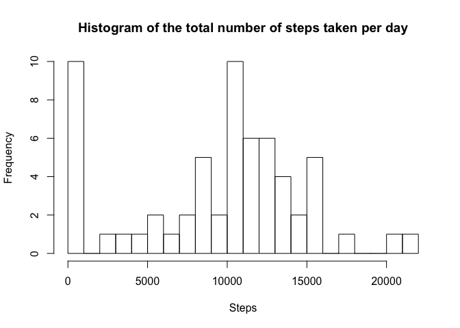

# Reproducible Research: Peer Assessment 1


## Loading and preprocessing the data


```r
# create the directory if it doesn't exist
if (!file.exists("data"))
{
    dir.create("data")
}

# download the data file if it isn't already there
if (!file.exists("data/activity.zip"))
{
    download.file("https://d396qusza40orc.cloudfront.net/repdata%2Fdata%2Factivity.zip", destfile="data/activity.zip", method="curl")
}

# extract the file if it isn't already extracted
if (!file.exists("data/activity.csv"))
{
    unzip("data/activity.zip", exdir="data")
}

# Now that we're sure that we have the data let's load it up
csv <- read.csv("data/activity.csv")
```

## What is mean total number of steps taken per day?

### Calculate the total number of steps taken per day


```r
byDay <- aggregate(csv$steps, by=list(Date=csv$date), FUN=sum, na.rm=TRUE)
```

The total number of steps taken per day is represented here by the variable x.

### Make a histogram of the total number of steps taken each day


```r
hist(byDay$x, breaks=20, xlab="Steps", main="Histogram of the total number of steps taken per day")
```

 

### Calculate and report the mean and median of the total number of steps taken per day

We can see the mean and the median in the summary of the byDay data set computed
earlier.


```r
summary(byDay)
```

```
##          Date          x        
##  2012-10-01: 1   Min.   :    0  
##  2012-10-02: 1   1st Qu.: 6778  
##  2012-10-03: 1   Median :10395  
##  2012-10-04: 1   Mean   : 9354  
##  2012-10-05: 1   3rd Qu.:12811  
##  2012-10-06: 1   Max.   :21194  
##  (Other)   :55
```

## What is the average daily activity pattern?

The following graph shows the daily activity pattern by plotting a time serries
of the averages of steps by interval.


```r
byInterval <- aggregate(csv$steps, by=list(Interval=csv$interval), FUN=mean, na.rm=TRUE)
plot(byInterval$Interval, byInterval$x, type="l", xlab="Interval", ylab="Average steps in interval", main="Average steps in interval")
```

 

It is not clear from the graph which interval has the highest value so we'll
compute it.


```r
maxVal <- max(byInterval$x)
byInterval[byInterval$x == maxVal,]
```

```
##     Interval        x
## 104      835 206.1698
```

## Imputing missing values


```r
summary(csv)
```

```
##      steps                date          interval     
##  Min.   :  0.00   2012-10-01:  288   Min.   :   0.0  
##  1st Qu.:  0.00   2012-10-02:  288   1st Qu.: 588.8  
##  Median :  0.00   2012-10-03:  288   Median :1177.5  
##  Mean   : 37.38   2012-10-04:  288   Mean   :1177.5  
##  3rd Qu.: 12.00   2012-10-05:  288   3rd Qu.:1766.2  
##  Max.   :806.00   2012-10-06:  288   Max.   :2355.0  
##  NA's   :2304     (Other)   :15840
```
From the summary we can see that only the steps column has NAs.


```r
temp = is.na(csv$steps)
print(paste("Total number of rows with NAs: ", length(csv$steps[temp]), sep=""))
```

```
## [1] "Total number of rows with NAs: 2304"
```

Filling in the missing values in steps with values computed in byInterval dataset.


```r
rowids <- 1:nrow(csv)
steps <- sapply(rowids, function(r) 
    {
        if (is.na(csv[r,]$steps))
        {
            steps <- byInterval[byInterval$Interval == csv[r,]$interval,]$x
        } else {
            steps <- csv[r,]$steps
        } 
})
newCsv <- csv 
newCsv$steps <- steps
```


```r
byDay <- aggregate(newCsv$steps, by=list(Date=newCsv$date), FUN=sum, na.rm=TRUE)
hist(byDay$x, breaks=20, xlab="Steps", main="Histogram of the total number of steps taken per day")
```

 

###Mean and median.

```r
summary(newCsv)
```

```
##      steps                date          interval     
##  Min.   :  0.00   2012-10-01:  288   Min.   :   0.0  
##  1st Qu.:  0.00   2012-10-02:  288   1st Qu.: 588.8  
##  Median :  0.00   2012-10-03:  288   Median :1177.5  
##  Mean   : 37.38   2012-10-04:  288   Mean   :1177.5  
##  3rd Qu.: 27.00   2012-10-05:  288   3rd Qu.:1766.2  
##  Max.   :806.00   2012-10-06:  288   Max.   :2355.0  
##                   (Other)   :15840
```

## Are there differences in activity patterns between weekdays and weekends?


```r
library(ggplot2)
csv$WW <- weekdays(as.Date(csv$date))
newWW <- sapply(csv$WW, function(x) {if (x == "Sunday" || x == "Saturday") {"weekend"} else {"weekday"}})
csv$WW <- newWW
byInterval <- aggregate(csv$steps, by=list(Interval=csv$interval, WW=csv$WW), FUN=mean, na.rm=TRUE)
p <- ggplot(byInterval, aes(x=Interval, y=x))
p <- p + geom_line()
p <- p + facet_wrap(~WW, ncol=1)
p <- p + xlab("Number of steps")
p <- p + ylab("Interval")
print(p)
```

 
